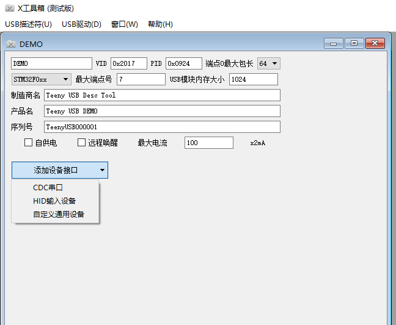
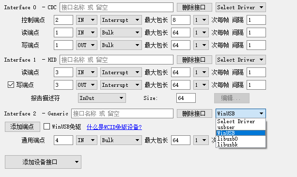
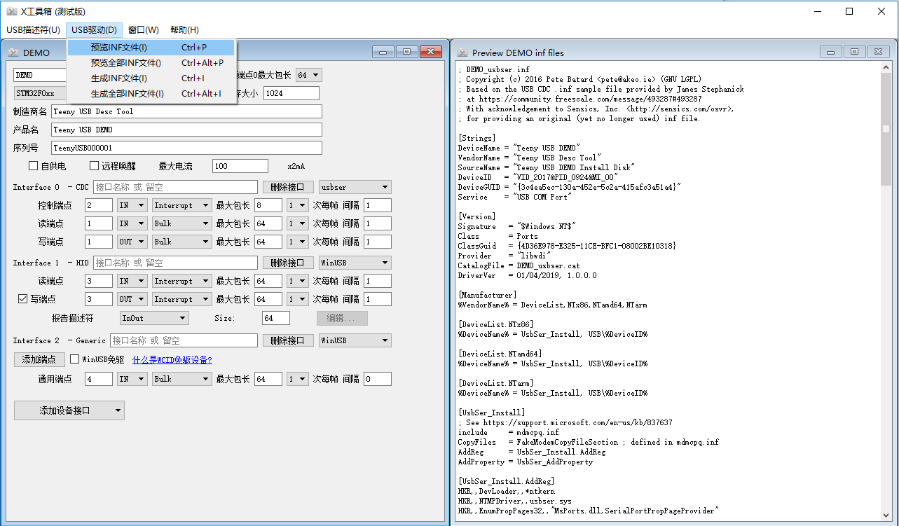

# TeenyUSB的描述符工具(Teeny Descriptor Tool)

## 特性 Features

1. 绿色图形化工具生成描述符和驱动，图形化工具不需要安装。GUI tool to generate descriptors and driver inf file, no install need.
2. 命令行工具根据配置自动生成USB描述符和端点初始化代码 Command line tool generate USB descriptors and Endpoint initial codes.
3. 根据配置生成驱动inf文件并签名 Auto generate driver's inf file and self sign.
4. 驱动生成相关功能依赖libwdi项目。 Driver related feature depends on [libwdi][libwdi_proj].

## 说明

* 支持命令行和图形化工具生成描述符和端点初始化代码，支持图形化工具生成驱动inf文件并签名。
* 通过解析描述符的配置文件，自动分析设备中的接口，并为接口分配编号。
* 自动分析描述符中的字符串，生成字符描述符及序号，合并相同的字符。
* 根据需要生成IAD描述符
* 根据配置生成WCID相关描述符
* 根据配置生成设备驱动inf文件，支持的类型与libwdi项目相同
* 生成驱动自签名文件，签名功能调用libwdi完成

## 图形化工具 GUI tool

图形化工具采用[XToolbox][xtoolbox_download]开发，XToolbox是一个[lua脚本驱动的Qt应用程序原型开发框架][xtoolbox_intro]，用lua封装了常见的Qt界面元素。

### 新建设备

运行descriptor_tool中的XToolbox.exe后，出现如下界面，在这里面配置设备的VID，PID，字符描述等信息。左下方的"添加设备接口"按键增加设备接口，目前支持CDC,HID和用户自定义设备。选择不同的设备系统会设置不同最大端点号和USB模块内存大小，设备列表定义在[device_list.lua][device_list]中。




### 添加接口

增加的接口如下图所示，不同接口需要配置不同的参数，对于通用接口，可以添加更多的端点。对于HID设备，可以定义其报告描述述的内容。




### 生成描述符和端点初始化定义

设备及接口定义好后，预览生成的描述符和端点定义文件。

* 创建设备 生成一个新的USB设备
* 预览描述符 查看当前设备的描述符
* 预览端点定义 查看当前设备的端点定义
* 生成代码会 生成当前设备的描述符和端点定义文件
* 生成全部代码 将所有设备的描述符和端点定义生成到同一个文件文件中


### 生成inf文件

设备及接口定义好后，预览生成的驱动inf文件。

* 预览INF文件 查看当前设备的INF文件，如果一个设备的多个接口配置了不同类型的驱动，则会为每种不同类型的驱动生成一个单独的INF文件。
* 预览全部INF文件 查看当前设备的INF文件
* 生成INF文件 生成当前设备的INF文件，并生成对应的自签名cat文件。
* 生成全部INF文件 生成全部设备的INF文件，并生成对应的自签名cat文件。




## 命令行工具 command line tool

命令行工具通过[lua 5.3][lua_download]生成描述符

### 命令行格式

```batch
lua gen_decriptor.lua
usage:
  lua usb_gen_desc.lua <inFile> [-maxep=<max ep number>] [-maxmem=<memory size in bytes>]
    inFile  - Input usb descriptor define file name
    -maxep  - max end point number
    -maxmem - max valid memory for USB core
```
inFile是USB设备配置文件，用来生成描述符的C语言代码，其格式见下面说明。maxep为USB模块的最大端点号，描述符中大于此号码的端点将会被忽略。maxmem为USB模块的内存大小，如果端点分配的内存大于此值，将会报错。执行后会在inFile相同目录下生成tiny_usb_desc.c和tiny_usb_init.h文件。tiny_usb_desc.c是设备描述符文件，包含USB设备的各种描述符。tiny_usb_init.h是端点定义文件，对于STM32F1xx和STM32F0xx芯片，会根据描述符中的端点信息，生成相应的端点初始化代码。查看生成的代码示例：[tiny_usb_desc.c][tiny_usb_desc_demo], [tiny_usb_init.h][tiny_usb_init_demo]

### 配置文件格式

```lua
return Device {
    strManufacture = "tiny usb",
    strProduct = "tiny usb bulk demo",
    strSerial = "tu123456",
    idVendor = 0x2017,
    idProduct = 0x0924,
    prefix = "BULK",
    Config {
        bMaxPower = 100,
        SelfPower = true,
        RemoteWakeup = true,
        Interface{
            WCID = WinUSB,
            EndPoint(IN(1),  BulkDouble, 64),
            EndPoint(OUT(2), BulkDouble, 64),
            strInterface = "TinyUsb1",
        },
        Interface{
            WCID = WinUSB,
            EndPoint(IN(3),  Bulk, 64),
            EndPoint(OUT(4), Bulk, 64),
            strInterface = "TinyUsb2",
        },
   }
}
```
上面是一个USB设备配置文件的示例，lua格式，定义了一个USB设备的VID PID以及相应的字符串。这个设备有两个接口，每个接口有两个Endpoint，分别作为收发端点。其中Interface 0的端点为bulk双缓冲模式，Interface 1的端点为bulk普通模式。prefix属性定义了设备的名称，在生成相关代码时会加上这个名称作为前缀。Interface中的WCID([什么是WCID?][what_is_wcid])属性，表示此接口支持WCID，后面的WinUSB表示其支持WinUSB兼容设备。也可以定义为其他设备。

也可以一次定义多个设备的配置，用不同的前缀进行区分
```lua
-- DEMO USB descriptor multiple device
return {
-- config device 1
Device {
    prefix = "Device1",
     ...
},
-- config device 2
Device {
    prefix = "Device2",
     ...
},
...
-- config device N
Device {
    prefix = "DeviceN",
     ...
}
}
```

设备配置的示例在[demo.lua][desc_demo]


[lua_download]: https://www.lua.org/download.html
[xtoolbox_download]: https://github.com/xtoolbox/Introduction/releases
[xtoolbox_intro]: https://github.com/xtoolbox/Introduction
[desc_demo]: ../usb_stack/demo/custom_bulk/custom_bulk_desc.lua
[what_is_wcid]: https://github.com/xtoolbox/teenyusb/wiki/WCID-Device
[tiny_usb_desc_demo]: ../usb_stack/demo/custom_bulk/tiny_usb_desc.c
[tiny_usb_init_demo]: ../usb_stack/demo/custom_bulk/tiny_usb_init.h
[device_list]: device_list.lua
[libwdi_proj]:https://github.com/pbatard/libwdi
